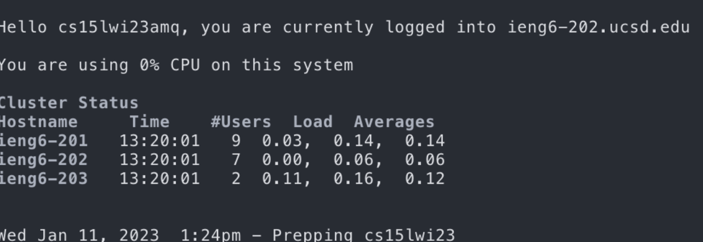

Junhao Qu
## CSE 15L Lab Report 1
1. Go to the official website and download the VScode. Add some java extension and junit.

2. Using SSH to connect the serve. Reset the passwords first and then connect to our account. We could see some user and time here.

3. First I try to use ls to find what files I have, and then type pwd to see where am I. I use Vim to create a txt file and try cp to create another file. Moreover I try ls -a and so on.

