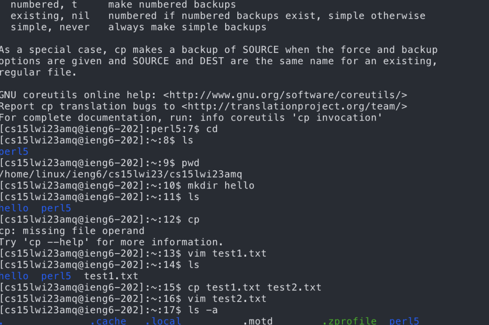

Junhao Qu
## CSE 15L Lab Report 1
1. Go to the official website https://code.visualstudio.com/ to download the VScode.   
   Go to the Java website https://www.oracle.com/java/technologies/javase/jdk14-archive-downloads.html to download Java  
   Go to the Junit website https://github.com/junit-team/junit4/wiki/Download-and-Install to download Junit  
   Then set up Junit, add to setting.jason.  
   

---


2. Using SSH to connect the serve. Reset the passwords first and then connect to our account. We could see some user and time here.  
   Following are step   

        //We will using following command
        $ ssh cs15lwi23amq@ieng6.ucsd.edu
        //Then Type Passwords

    Then we will see user name, cpu usage, cluster status amd the login time here. I find the Hostname are same among us, however the load and averages time are different, maybe it caused by internet connection.     
        

3. Here we should test some command

```
    //it will change directory
    $ cd
    //it will list all files under the current directory
    $ ls
    //it will show the current directory
    $ pwd
    //it will create a new file by vim
    $ vim Test.txt
    //it will copy from Test.txt to Test2.txt
    $ cp Test2.txt Test.txt 
    //it will list with hidden files/directories:
    $ ls -a
```

